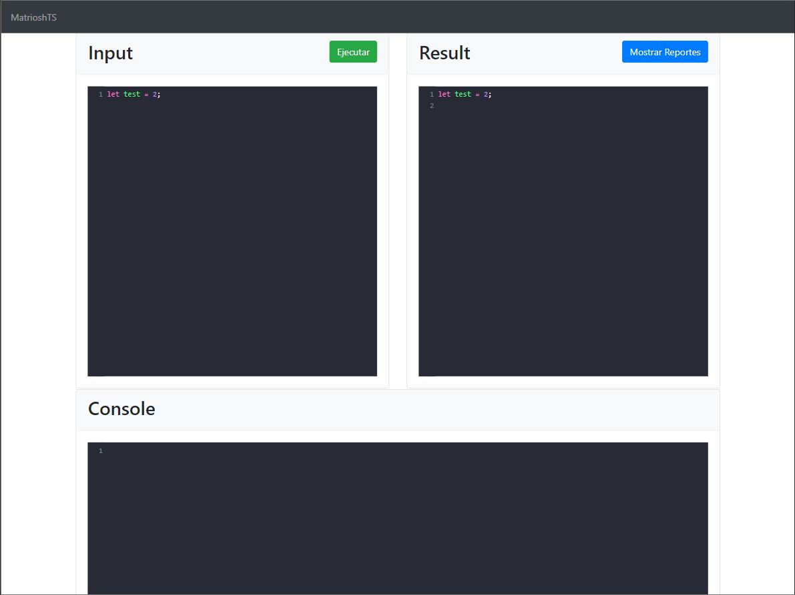

# MatrioshTS
## Table of contents
* [General info](#general-info)
* [Technologies](#technologies)
* [Setup](#setup)
* [Screenshots](#screenshots)

## General info
A project that translates a typescript like a language with nested functions to javascript, the application uses jison to create a lexer and parser that recognizes the language. 

It includes a graphical view of the AST generated and a table of errors that the language might have.
	
## Technologies
Project is created with:
* Bootstrap
* Javascript
* Jison
* Codemirror
* Graphviz
	
## Setup
To run this project:


```
just open the index.html on a browser, is a static site
```
## Screenshots

